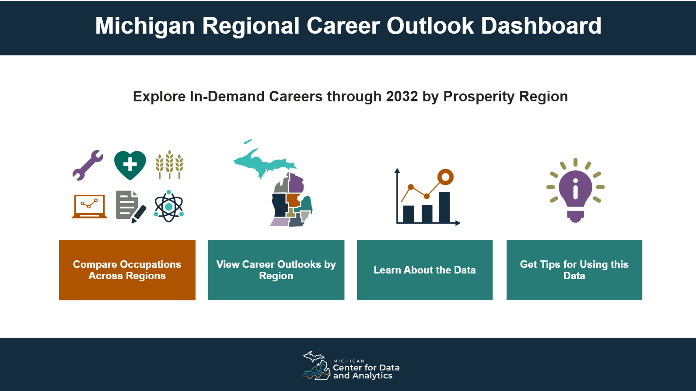
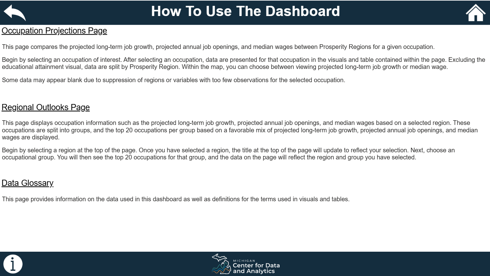
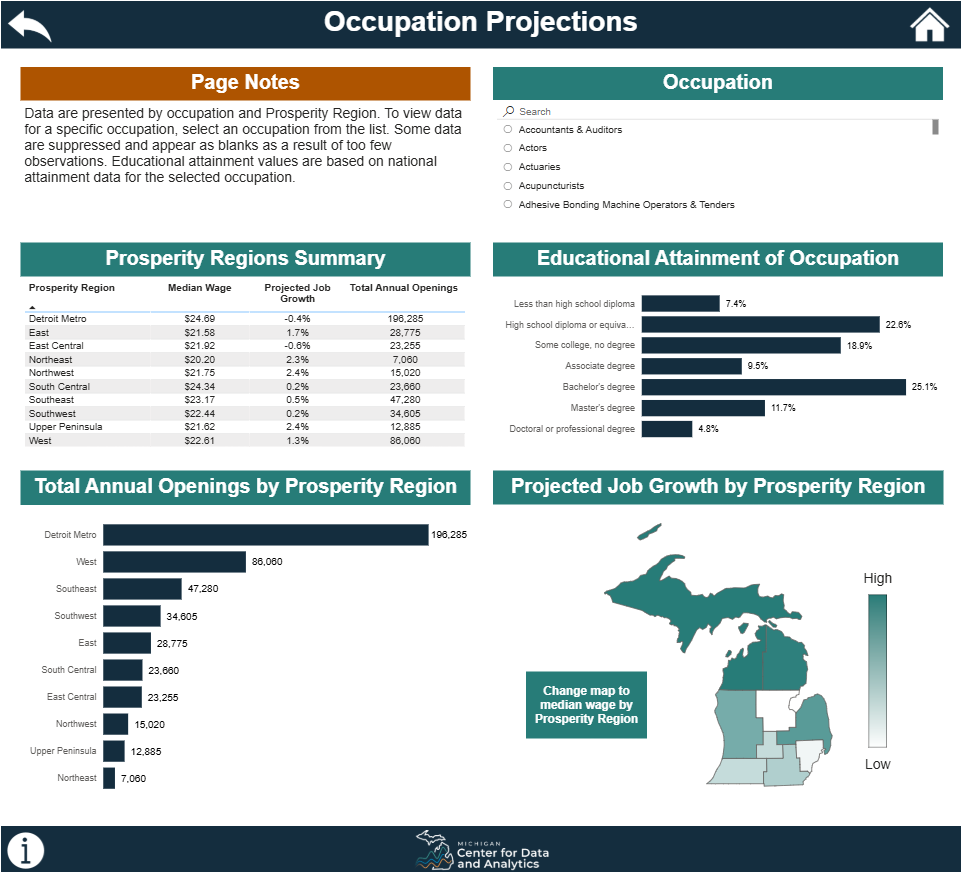
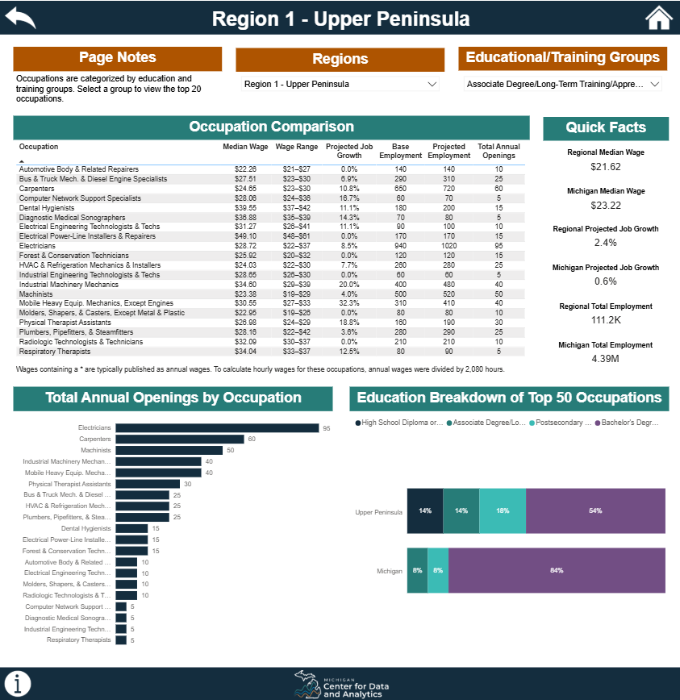
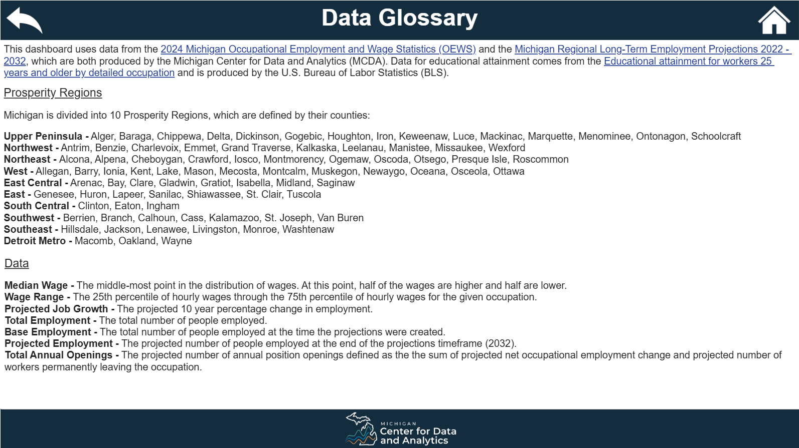

# Michigan Regional Career Outlook Dashboard

## Overview
This project documents the design and development of an interactive Power BI
dashboard created for the **State of Michigan** to provide clear, accessible
information about **in-demand occupations** for students, jobseekers, educators,
and policymakers.

The dashboard is publicly hosted on a Michigan government website and is intended
to support workforce planning, career exploration, and policy decision-making
through data-driven insights.

## Role & Contribution
Besides style suggestions for the homepage, I was the sole developer of this dashboard 
and was responsible for the end-to-end design and implementation, including data modeling,
analytics, Power BI development, and accessibility compliance.

## Live Dashboard
🔗 **View the live dashboard:**  
https://www.michigan.gov/mcda/data-tools/michigan-regional-career-outlook-dashboard

> **Note:** This repository serves as a portfolio showcase. The Power BI (.pbix)
file is not included due to hosting and distribution constraints.

---

## Dashboard Objectives
- Support career exploration for students and jobseekers
- Inform policymakers and workforce planners about regional labor market demand
- Present complex labor market data in an accessible, user-friendly format
- Ensure usability for a broad public audience, including users with disabilities

---

## Key Features

### Regional Labor Market Insights
- Displays **occupational wages and job-growth projections** for hundreds of occupations 
across Michigan’s **Prosperity Regions** (county clusters)
- Enables comparison of labor market trends and in-demand occupations across regions

### In-Demand Occupation Rankings
- Identifies **highest-ranked occupations** for each region and
  education/training group
- Rankings are based on a composite assessment of:
  - Wages
  - Projected annual job openings
  - Projected employment growth

### Accessibility-First Design
The dashboard was designed to meet accessibility standards, including but limited to:
- Logical tab order for keyboard navigation
- Alt-text for all relevant visual elements
- High-contrast, colorblind-friendly color palettes
- Clear labeling and readable typography

### Usability Enhancements
- Built-in **“How to Use”** guidance to help users navigate the dashboard
- **Data glossary** explaining key terms and metrics for non-technical users

---

## Data & Analytics
- Labor market data sourced from publicly available state and federal datasets
- Modeled to support occupational and regional comparisons
- Custom calculations and measures implemented using Power BI and DAX
- Data transformation and cleaning performed in R before upload

---

## Screenshots

---

## Impact
- Provides transparent, public access to workforce demand information
- Supports informed career and training decisions statewide
- Improves clarity and usability of labor market data for diverse audiences
- Reduces reliance on static reports through interactive exploration

---

## Disclaimer
All data presented in this repository is publicly available. Screenshots and
documentation are provided for demonstration and portfolio purposes only.
Sensitive or restricted information has been excluded.

